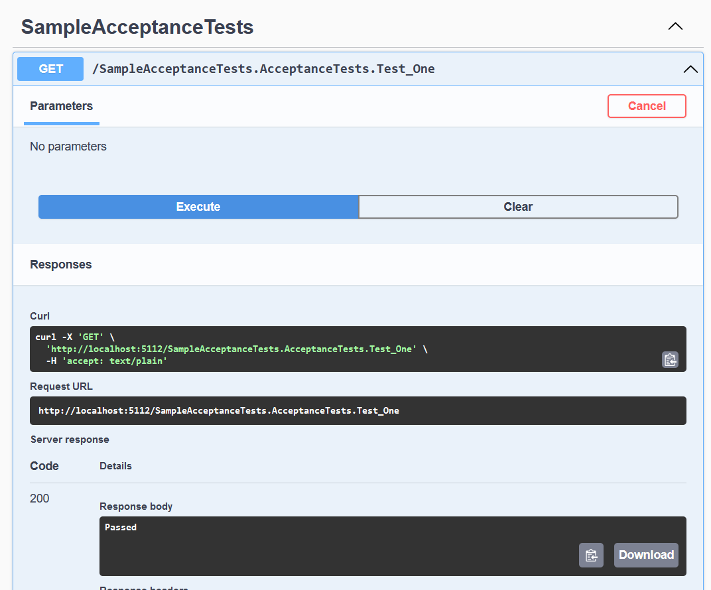

# Xunit.Runner.Http
Enables you to run your tests via http requests instead of the Test Explorer.

## Why?
When writing acceptance/integration tests it's useful to be able to debug the system under test and the tests themselves at the same time. I've found that the current tooling doesn't provide a great developer experience for doing so.

### Alternatives
These are the alternatives I've used in the past and found to be lacking.

#### Microsoft.AspNetCore.TestHost
I found that this option has a few downfalls for the way I like to work. 

* Requires application configuration to be in the test project. This usually leads to a lot of duplication of configuration or clunky workarounds.
* Acceptance tests written with TestHost can't be run against a live environment like in a CI/CD pipeline against an ephemeral environment.

#### Two Visausl Studio Instances
By opening the same solution in two instances of Visual Studio you can run the system under test in debug mod in one instance and use the Test Explorer to debug your tests in another. This is clunky at best.

## Overview
This package will automatically discover your tests and expose them using Minimal API Get endpoints. You can then invoke your tests by doing a get request to the fully qualified name of your test method. For example if you have the following test:

```
namesapce MyNamespace;

public class MyTestClass
{
	[Fact]
	public void MyTestMethod()
	{
	}
}
```

You can invoke it by doing a GET request to `/MyNamespace.MyTestClass.MyTestMethod`. The response will contain either "Passed" or the xUnit failure message you're used to seeing in Test Explorer.

### List of Tests in SwaggerUI


### Passing Test


### Failing Test


## Usage
In order to use this library you'll need to turn your test project into `Microsoft.NET.Sdk.Web` project and add a `Program.cs` file that creates a web app. Then you'll need to:

Register the test runner with dependency injection:

`services.AddXunitHttpTestRunner(typoef(MyTestAssembly).Assembly);`

Tell the application to use the test runner:

`app.UseXunitHttpTestRunner();`

That's it! 

See the [Samples](samples) for a runnable example. 

