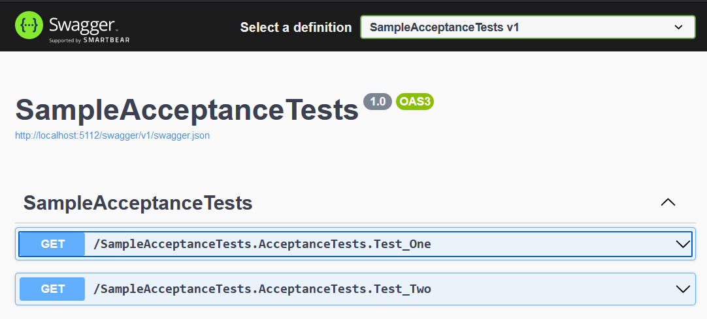
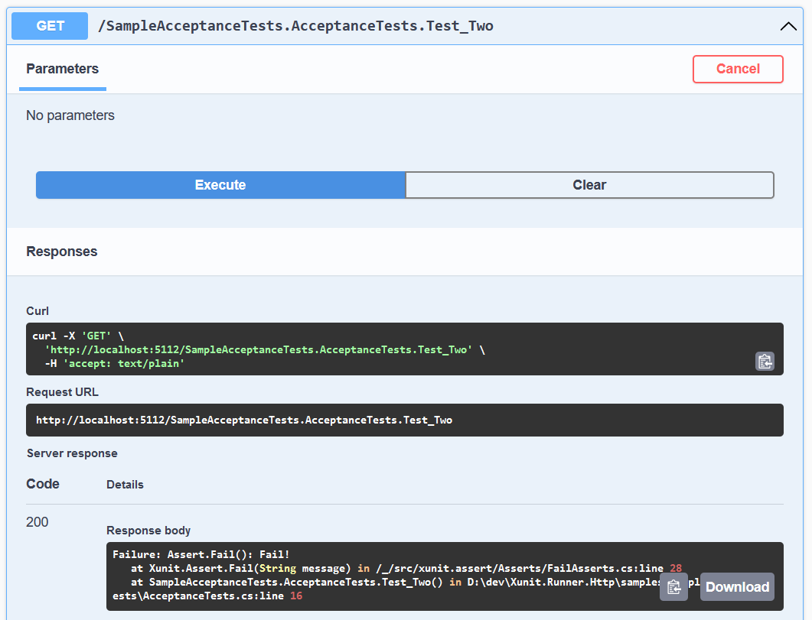

# Xunit.Runner.Http
Enables you to run your tests via http requests.

## Why?
The main catalyst for this library is to enable a way to easily run & debug Acceptance tests alongside the system they're testing. In Visual Studio, for example, if you're running an API there is no way for you to trigger and debug an acceptance test you want to run against the API. This is particularly annoying if you're trying to practice ATDD. In this case your only options are usually to either run two instances of Visual Studio, one with your API running and one where you debug your acceptance tests or run your API without debugging so that you can debug your acceptance tests. Neither options is pleasant or straightfoward. 

With this package you'll be able to start your API and your acceptance test projects at the same time. On startup of your acceptnace test project we'll discover your tests and expose a Get endpoint for each of your tests. If you have swagger UI enabled you'll be able to invoke your tests through that. Otherwise you can simply invoke them by doing a get to fully qualified name of your test method. For example the following test will be expose at `/MyNamespace.MyTestClass.MyTestMethod`:

```
namesapce MyNamespace;

public class MyTestClass
{
	[Fact]
	public void MyTestMethod()
	{
	}
}
```

### List of Tests in SwaggerUI


### Passing Test


### Failing Test


## Usage
In order to use this library you'll need to turn your test project into `Microsoft.NET.Sdk.Web` project and add a `Program.cs` file that creates a web app. Then you'll need to:

Register the test runner with dependency injection:

`services.AddXunitHttpTestRunner(typoef(MyTestAssembly).Assembly);`

Tell the application to use the test runner:

`app.UseXunitHttpTestRunner();`

That's it! 

See the samples for a runnable example. 